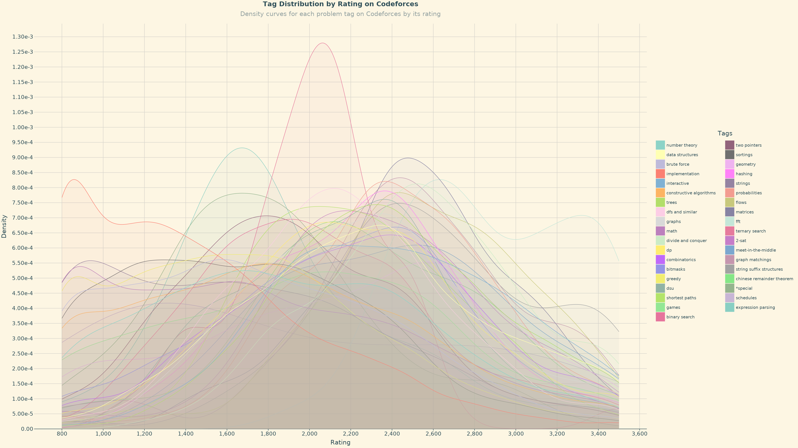

# Programming Contest Problem Tag Analyzer

A Jupyter notebook to analyze the distribution of problem tags for programming contest problems on Codeforces and
CodeChef.

## TODO

- [x] Think of a better way to visualize the data
- [ ] Pull data using the CodeChef API
- [ ] Include other features of the problem in Codeforces analysis such as index
- [ ] Possibly filter problems based on contest name (keep only those from the Codeforces Rounds)
- [ ] Use the color scheme from the Codeforces rating system to modify the lines and fill from left to right